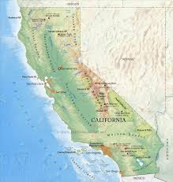

# Predição dos valores das casas na California

Os dados dizem respeito às casas encontradas em um determinado distrito da Califórnia e algumas estatísticas resumidas sobre elas com base nos dados do censo de 1990. Para este projeto, foi utilizado conjunto de dados disponível no [Kaggle](https://www.kaggle.com/datasets/camnugent/california-housing-prices).



## Organização do projeto

```
├── .gitignore         <- Arquivos e diretórios a serem ignorados pelo Git
├── ambiente.yml       <- O arquivo de requisitos para reproduzir o ambiente de análise
├── LICENSE            <- Licença de código aberto (MIT)
├── README.md          <- README principal para desenvolvedores que usam este projeto.
|
├── dados              <- Arquivos de dados para o projeto.
|
├── modelos            <- Modelo treinado e serializado
|
├── notebooks          <- Jupyter Notebooks (.ipynb).
│
|   └──src             <- Código-fonte para uso neste projeto.
|      │
|      ├── __init__.py     <- Torna um módulo Python
|      ├── config.py       <- Configurações básicas do projeto
|      └── auxiliares.py   <- Funções auxiliares do projeto
|      ├── graficos.py     <- Funções que geram os gráficos
|      └── modelos.py      <- Funções criadas para a etapa de modelagem
|
├── referencias        <- Dicionários de dados.
|
├── imagens            <- Imagens utilizadas no projeto.
```

## Configuração do ambiente

1. Faça o clone do repositório.

    ```bash
    git clone git@github.com:thicampregher/california-house-price-prediction.git
    ```

2. Crie um ambiente virtual para o seu projeto utilizando o `conda`.

    ```bash
    conda env create -f environment.yml --name californa-project
    ```

## Um pouco mais sobre a base

[Clique aqui](referencias/01_dicionario_de_dados.md) para ver o dicionário de dados da base utilizada.
